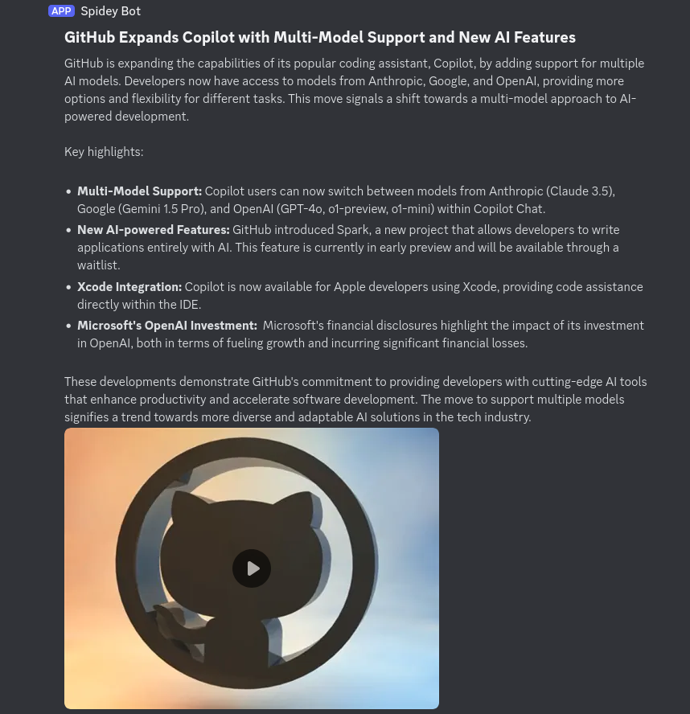

# Discord News Summarizer
This program uses DuckDuckGo to scrape news headlines related to your search term from the past week, sends it to Google Gemini for summarization, converts the summary to a mp4 file using text-to-speech server then send both text and audio versions to Discord via webhook.

Requirements:
 - Python3
 - FFmpeg
 - Docker
 - Google Gemini API key (free if you have a Google account): https://aistudio.google.com/app/apikey
 - Discord webhook URL: https://support.discord.com/hc/en-us/articles/228383668-Intro-to-Webhooks

```
pip install -r requirements.txt
docker compose up -d
cp .env.example .env
```
edit the `.env` file with your API key and wekhook URL then run:
```
$ python main.py android
Edge-TTS server at 127.0.0.1:5050 is accessible
Mp3 file saved to android.mp3
Thumbnail saved https://tse2.mm.bing.net/th?id=OIP.wwSRKkPSrIvOSP2I6J0OtQHaEo&pid=Api as android.jpg
Combined android.mp3 and android.jpg into android.mp4
Deleted android.mp3 and android.jpg
Summary sent to Discord. Length: 1697 characters
```
if everything works you should see something like this in your Discord channel. 
